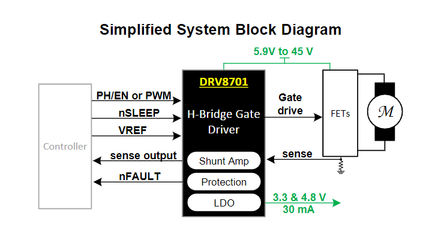

---
title:DRV 8701电机驱动学习记录
date: 2014-07-16T01:44:00+08:00
tags:
  - 电机驱动
---
# DRV 8701

## 简介

​	DRV8701 是一款H桥门驱动器，可以驱动4个外部的N沟道mos管，允许有100%的PWM波占空比。DRV8701工作电压在5.9伏至45伏，根据型号的不同有两种控制接口，一种是PH/EN(DRV8701E)，另一种是PWM(DRV8701P)。

​	DRV8701 具有5个等级的可调整门极驱动。

​	DRV8701 支持1.8V 3.3V 以及5V的逻辑输入电平。

### 综述

​	DRV8701是一款使用四个外部N沟道MOSFET的单H桥门驱动器，目标是驱动12-V至24-V双向有刷直流电机。 

​	PH/EN（DRV8701E）或 PWM（DRV8701P）接口允许与控制器电路简单接口。内部感应放大器允许可调节的电流控制。门驱动器包括使用固定关断时间PWM电流斩波来调节绕组电流的电路。 DRV8701以9.5-V Vcs门驱动电压驱动高侧和低侧FET。所有外部FET的门驱动电流可通过IDRIVE引脚上的单个外部电阻器进行配置。

​	 提供了一种低功耗睡眠模式，该模式关闭内部电路以实现非常低的静态电流消耗。通过将nSLEEP引脚拉低可以设置睡眠模式。 提供了内部保护功能： 欠压锁定、充电泵故障、过电流关闭、短路保护、预驱动故障和过温。故障情况通过nFAULT引脚指示。

> note： 上面这一段是我从数据手册直接翻译的,嘻嘻

一个简要的系统框图如下所示

### 引脚配置和功能

 DRV 8701E（ PH/EN） 

| NAME | NO   | TYPE  | Logic               | Description                      |
| ---- | ---- | ----- | ------------------- | -------------------------------- |
| EN   | 14   | Input | Bridge enable input | 逻辑低电平将桥接电路置于刹车模式 |
| PH   | 15   | Input | Bridge enable input | 控制H桥的方向                    |

 DRV 8701P（ PWM） 

| NAME | NO   | TYPE  | Logic            | Description                          |
| ---- | ---- | ----- | ---------------- | ------------------------------------ |
| IN1  | 15   | Input | Bridge PWM input | Logic controls the state of H-bridge |
| IN2  | 14   | Input | Bridge PWM input | Logic controls the state of H-bridge |

 Common Pins 

| NAME   | NO       | TYPE       | Logic                          | Description                                                  |
| ------ | -------- | ---------- | ------------------------------ | ------------------------------------------------------------ |
| VM     | 1        | Power      | Power supply                   | Connect to motor supply voltage; bypass to GND with a 0.1uF ceramic plus a 10-uF minimum capacitor rated for VM; additional capacitance may be required based on drive current |
| GND    | 5,6,PPAD | Powerd     | Device Ground                  | Must be connected to ground                                  |
| VCP    | 2        | Power      | Charge pump output             | Connect a 16-V, 1uF ceramic capacitor to VM                  |
| CPH    | 3        | Power      | Charge pump switching nodes    | Connect a 0.1uF X7R capacitor rated for VM betweenn CPH and CPL |
| CPL    | 4        | Power      | Charge pump switching nodes    | Connect a 0.1uF X7R capacitor rated for VM betweenn CPH and CPL |
| DVDD   | 8        | Power      | Logic regular                  | 3.3V logic supply regulator; bypass to GND with a 6.3V, 1uF ceramic capacitor |
| VDD    | 7        | Power      | Analog regular                 | 4.8V analog supply regulator; bypass to GND with a 6.3V, 1uF ceramic capacitor |
| nSLEEP | 13       | Input      | Device sleep mode              | Pull logic low to put device into a low-power sleep mode with FETs High-Z; internal  pulldown |
| IDRIVE | 12       | Input      | Gate drive current setting pin | Resistor value or voltage forced on this pin sets the gate drive current |
| VREF   | 6        | Input      | Analog reference input         | Controls the current regulation; apply a voltage between 0.3V and AVDD |
| nFAULT | 9        | Open Drain | Fault indication pin           | Pulled logic low with fault condition; open-drain output requires an external pullup |
| SNSOUT | 10       | Open Drain | Sense comparator output        | Pulled logic low when the drive current hits the current chopping threshold; open-drain output requires an external pullup |
| SO     | 11       | Output     | Shunt amplifier output         | Voltage on this pin is equal to the SP voltage times $ A_v$ plus an offest; place no more than 1 nF of capacitance on this pin |
| SN     | 20       | Input      | Shunt amplifier nagative input | Connect to SP through current sense resistor and to GND      |
| SP     | 21       | Input      | Shunt amplifier positive input | Connect to low-side FET source and SN through current sense resistor |
| GH1    | 17       | Output     | High-side gate                 | Connect to high-side FET gate                                |
| GH2    | 24       | Output     | High-side gate                 | Connect to high-side FET gate                                |
| GL1    | 19       | Output     | Low-side gate                  | Connect to low-side FET gate                                 |
| GL2    | 22       | Output     | Low-side gate                  | Connect to low-side FET gate                                 |
| SH1    | 18       | Input      | Phase node                     | Connect to high-side FET gate source and low-side FET drain  |
| SH2    | 23       | Input      | Phase node                     | Connect to high-side FET gate source and low-side FET drain  |

## 细节描述

#### Overview

DRV8701是一款H桥门驱动器（也称为预驱动器或控制器）。该设备集成了FET门驱动器，以控制四个外部NMOS FETs。设备可以在5.9伏到45伏的供电电压下工作。

简单的PH/EN（DRV8701E）或PWM（DRV8701P）接口允许与控制器电路进行连接。包含一个低功耗睡眠模式，可以通过nSLEEP引脚启用。

门驱动强度可以调节，以优化系统对给定FET的性能，无需在FET门上添加外部电阻。IDRIVE引脚允许选择注入外部FET门的峰值电流。当VM大于12V时，高侧和低侧FETs通常以9.5V的Vcs电压驱动。在较低的VM电压下，Vcs会降低。高侧门驱动电压是使用双倍架构的充电泵产生的，调节到VM + 9.5V。

该设备通过将必要的FET驱动电路集成到单一设备中，极大地减少了离散电机驱动系统的组件数量。此外，DRV8701增加了传统离散实现之外的保护特性：欠电压锁定（UVLO）、过流保护（OcP）、预驱动器故障和热关闭。

内置了使用固定时间关断电流斩波方案的启动（冲击）或运行电流限制。斩波电流水平是通过选择感应电阻值和设置VREF引脚上的电压来设定的。

提供了一个分压放大器输出，供系统控制器进行精确的电流测量。SO引脚输出的电压是感应电阻上电压的一半。